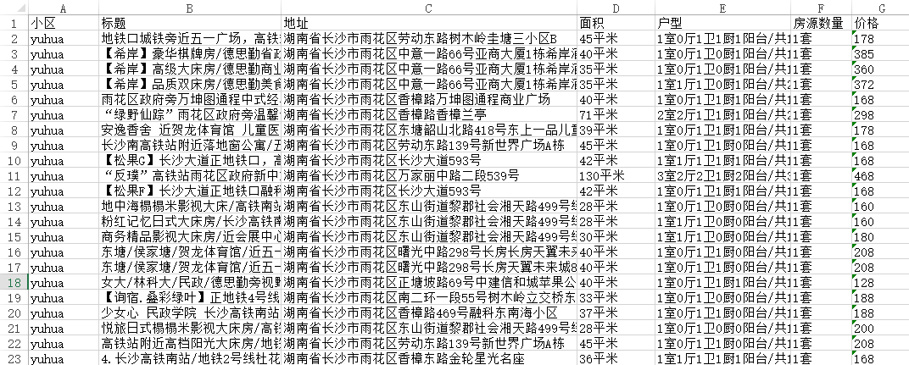
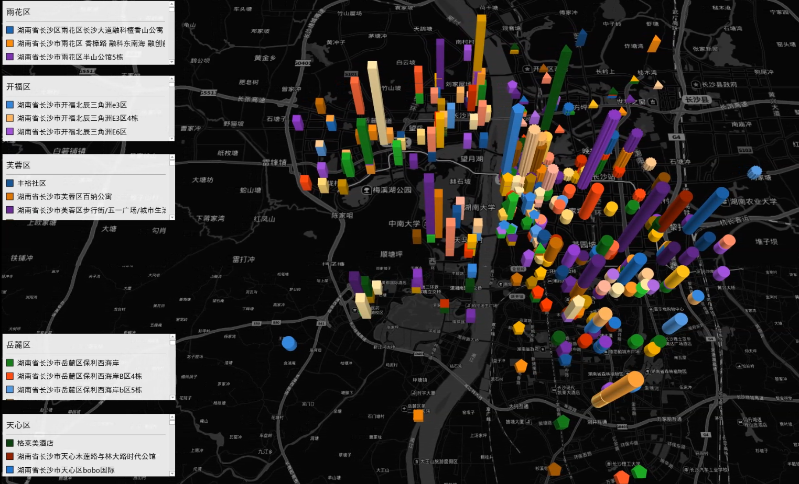

爬取小猪上民宿的数据，网址：<https://cs.xiaozhu.com/>

1、爬取小猪平台上湖南省长沙市雨花区、芙蓉区、岳麓区、开福区、天心区的民宿分布数据，包括民宿地址、面积、户型、数量价格等。

2、最后利用excel的powermap插件，以民宿地址为经纬度坐标，民宿价格作为高进行可视化。

3、通过分析已有民宿的分布，来规划未来民宿的选址。

爬取的数据：

可视化后：

动态对比五个区的数据：

<video src="img/xiaozhuVideo.mp4" controls="controls" width=100% height=100%>您的浏览器不支持播放该视频！</video>